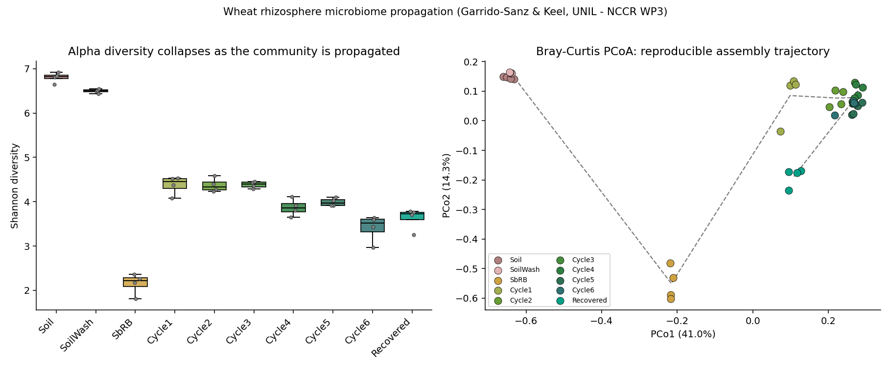

# Reproducible wheat rhizosphere microbiome (NCCR Microbiomes)

A small, real, end-to-end R project for a 15-minute Renku demo aimed at reproducing the core result of a
wheat-rhizosphere propagation experiment and showing how Renku makes that result
reproducible and shareable: **code + data + environment + compute in one place.**

> **The story in one line:** the biology here is *reproducible* (4 replicates
> per group cluster tightly, communities assemble the same way each cycle) — and
> Renku makes the *analysis of it* just as reproducible. One click, same figure,
> anywhere.

## What it does

1. `analysis/00_get_data.R`: stages the raw ASV count table, taxonomy and
   sample metadata from the mounted Zenodo data connector into `data/`.
2. `analysis/01_build_phyloseq.R`: builds a filtered `phyloseq` object from the
   ASV count table, taxonomy and sample metadata.
3. `analysis/02_diversity_ordination.R`: computes alpha diversity and a
   Bray-Curtis PCoA and writes the figure below to `outputs/`.



*Left:* Shannon diversity collapses from diverse soil, through a seed-borne
bottleneck, to a stable propagated community. *Right:* Bray-Curtis PCoA — tight
replicate clusters (reproducibility) tracing the assembly trajectory
(PCo1 ≈ 41%, PCo2 ≈ 14%).

## Data

Garrido-Sanz & Keel, *Sequential propagation of a reproducible wheat rhizosphere
microbiome* (Keel lab, UNIL).
Zenodo **10.5281/zenodo.14514438** · CC-BY-4.0. See `data/README.md`.

## Environment (conda)

`environment.yml` is the single source of truth for dependencies: R plus every
CRAN/Bioconductor package the analysis imports (`phyloseq`, `data.table`,
`tibble`, `dplyr`, `ggplot2`, `patchwork`). It is used to build the Renku
session environment and to run the pipeline, so the environment is identical
on a laptop, in CI, and on RenkuLab. RStudio itself is provided by the Renku
session image (see the `R_bioconductor_NCCR_microbiomes` project).

Create it within the session through: `conda env create -f environment.yml`
Activate it via: `conda activate renku-wp3-demo`

## Run it

**On RenkuLab (the demo path):** open the project → start the RStudio session →
in the R console:

```r
source("analysis/00_get_data.R")
source("analysis/01_build_phyloseq.R")
source("analysis/02_diversity_ordination.R")
```

The figure appears in `outputs/`.

**As a pipeline (optional):** `snakemake --cores 1` runs the whole DAG,
including the data-staging step, and only re-runs a step when its inputs
change.

**Locally:** `conda env create -f environment.yml && conda activate renku-wp3-demo`,
then the same three `source()` calls (or `snakemake`) — with the Zenodo data
connector mounted as a sibling directory of this project.

## Layout

```
├── analysis/
│   ├── 00_get_data.R              # unzips the data connector into data/
│   ├── 01_build_phyloseq.R        # data -> filtered phyloseq object
│   └── 02_diversity_ordination.R  # alpha + beta diversity -> figure
├── data/                          # staged input files (git-ignored)
├── outputs/                       # figures & tables land here
├── environment.yml                # conda dependency spec (source of truth)
├── Snakefile                      # optional reproducible pipeline
└── README.md
```

## Attribution

Data © the original authors, reused under CC-BY-4.0 (Zenodo 10.5281/zenodo.14514438).
This demo scaffold is provided for teaching Renku within NCCR Microbiomes.
